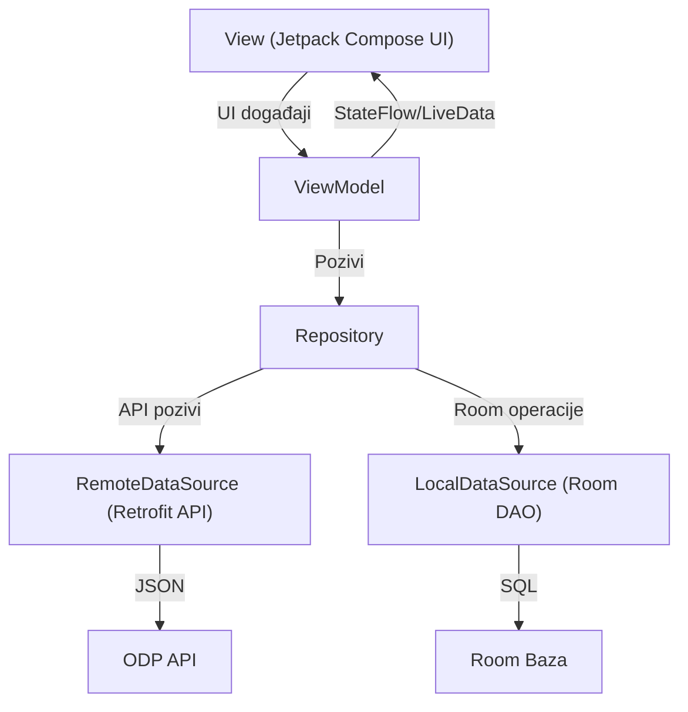

# Dokumentacija Android aplikacije: Registracije vozila i vozačke dozvole

---

## 1. Opis aplikacije

Aplikacija omogućava korisnicima pregled i analizu podataka sa Portala Otvorenih Podataka Bosne i Hercegovine (odp.iddeea.gov.ba), konkretno:
- **Registracije vozila**
- **Važeće vozačke dozvole**

Korisnik na početnom (onboarding) ekranu bira dataset koji želi pregledati. Svaki dataset ima:
- Prikaz liste podataka
- Detaljan prikaz pojedinačne stavke
- Filtriranje i sortiranje
- Favoritizaciju i poseban ekran za favorite
- Grafičku vizualizaciju (bar chart)
- Dijeljenje podataka
- Offline keširanje (Room baza)

Aplikacija je dizajnirana za jednostavnu upotrebu, sa jasnim korisničkim tokovima i modernim vizuelnim identitetom. Posebna pažnja posvećena je responzivnosti i pristupačnosti, kako bi aplikacija bila upotrebljiva na različitim uređajima i za sve korisnike.

### Primjeri ekrana

**Onboarding ekran**


**Lista registracija vozila**


**Detalji registracije**


**Lista vozačkih dozvola**


**Favoriti**


**Grafikon**


---

## 2. Arhitektura aplikacije (MVVM)

Aplikacija koristi **MVVM (Model-View-ViewModel)** arhitekturu, što omogućava jasnu separaciju odgovornosti, testabilnost i jednostavno održavanje. MVVM je posebno pogodan za Jetpack Compose aplikacije jer omogućava reaktivno ažuriranje UI-a na promjene podataka i stanja.

### Dijagram komponenti



**Vizualizacija dijagrama:**


### Komponente:
- **View (Compose UI):** Svi ekrani su napisani u Jetpack Compose-u. Prikazuju podatke i šalju korisničke akcije ViewModel-u. UI je deklarativan i automatski se ažurira na promjene stanja.
- **ViewModel:** Posreduje između UI i repozitorija. Sadrži poslovnu logiku, upravlja stanjem (StateFlow), filtriranjem, sortiranjima, favoritima, errorima. Koristi SavedStateHandle za spašavanje UI stanja i omogućava preživljavanje promjene orijentacije i kill/restart procesa.
- **Repository:** Centralizuje pristup podacima (API + Room). Implementira strategiju keširanja i offline podršku, te omogućava jednostavno testiranje i zamjenu izvora podataka.
- **RemoteDataSource (Retrofit API):** Komunikacija sa ODP API-jem, obrada JSON odgovora, mapiranje podataka u domenske modele.
- **LocalDataSource (Room DAO):** Pristup lokalnoj bazi (Room), omogućava keširanje i rad offline, kao i brzu pretragu i filtriranje podataka.

---

## 3. Detaljan opis ekrana i korisničkih tokova

### Onboarding ekran
Na prvom pokretanju aplikacije korisniku se prikazuje onboarding ekran sa izborom između dva dataset-a: registracije vozila i važeće vozačke dozvole. Ovaj ekran je dizajniran tako da korisniku jasno predstavi mogućnosti aplikacije i omogući brz početak rada. Dugmad su jasno označena, a korisnik može u svakom trenutku promijeniti dataset kroz meni ili povratak na onboarding. Onboarding je implementiran kao zaseban Composable, a izbor dataset-a se pamti u ViewModelu i SavedStateHandle-u.

### HomeScreen (Lista podataka)
Nakon odabira dataset-a, korisnik dolazi na početni ekran sa listom podataka. Ovdje su dostupne sljedeće funkcionalnosti:
- Prikaz liste podataka (vozila ili dozvole) u LazyColumn-u, sa podrškom za paging kod velikih datasetova
- Pretraga i filtriranje (npr. po tipu vozila, godini, statusu, kategoriji dozvole)
- Sortiranje (npr. po datumu, abecedi, statusu)
- Osvježavanje podataka povlačenjem (pull-to-refresh)
- Navigacija na detalje klikom na stavku
- Dodavanje/uklanjanje iz favorita dugmetom sa zvjezdicom
- Pristup grafičkoj vizualizaciji i favoritima kroz gornji meni
- Prikaz loading indikatora i error poruka (Snackbar)
- Responsive layout: na tabletima i većim ekranima lista i detalji mogu biti prikazani paralelno (master-detail)

### DetailsScreen (Detalji stavke)
Klikom na stavku iz liste otvara se ekran sa detaljnim informacijama. Ovdje korisnik može:
- Vidjeti sve dostupne podatke o stavci (npr. marka, model, godina, status registracije, ime vlasnika, datum izdavanja dozvole, kategorija...)
- Dodati/ukloniti iz favorita (status se odmah reflektuje u bazi i UI-u)
- Podijeliti podatke putem drugih aplikacija (share dugme koristi Android Intent)
- Vratiti se na listu ili onboarding
- Prikazati grešku ako podaci nisu dostupni (npr. zbog gubitka interneta ili greške u bazi)

### FavoritesScreen (Favoriti)
Ovaj ekran prikazuje sve stavke koje je korisnik označio kao favorite. Favoriti su dostupni i offline, a korisnik može ukloniti stavke iz favorita ili ih detaljno pregledati. Lista favorita se automatski ažurira na promjene u bazi.

### ChartScreen (Grafikon)
Na ovom ekranu korisnik može vidjeti grafičku vizualizaciju podataka (npr. broj registracija po godini, broj dozvola po kategoriji). Grafikon je implementiran ručno koristeći Compose Canvas, a podaci se dinamički generišu na osnovu filtriranih/sortiranih podataka. Na većim ekranima grafikon može biti prikazan uz listu ili detalje.

---

## 4. Prošireni primjeri korisničkih scenarija

- **Scenario 1: Pronalazak registracije i dijeljenje podataka**
  1. Korisnik pokreće aplikaciju i bira "Registracije vozila".
  2. U listi koristi pretragu da pronađe svoje vozilo po broju tablica.
  3. Klikom na stavku otvara detalje, provjerava status i dijeli podatke sa prijateljem putem WhatsApp-a.

- **Scenario 2: Analiza vozačkih dozvola i rad sa favoritima**
  1. Korisnik bira "Važeće vozačke dozvole".
  2. Sortira listu po datumu izdavanja.
  3. Dodaje nekoliko dozvola u favorite.
  4. Pregledava grafikon raspodjele po kategorijama.
  5. Offline, korisnik i dalje može pristupiti favoritima i detaljima.

- **Scenario 3: Offline pristup i fallback**
  1. Korisnik koristi aplikaciju bez interneta.
  2. Lista i favoriti su i dalje dostupni zahvaljujući Room keširanju.
  3. Prilikom ponovnog spajanja na internet, podaci se automatski osvježavaju.

- **Scenario 4: Edge-case – greška pri učitavanju**
  1. API privremeno vraća nevažeći JSON.
  2. ViewModel prepoznaje grešku i šalje error state.
  3. UI prikazuje Snackbar sa porukom i nudi opciju ponovnog pokušaja.

- **Scenario 5: Napredna filtriranja i rad na tabletu**
  1. Korisnik na tabletu koristi napredne filtere (npr. kombinacija više kriterija).
  2. Lista i detalji su prikazani paralelno.
  3. Promjena filtera odmah ažurira i listu i grafikon.

---

## 5. Detaljan opis ključnih klasa i funkcija

### ViewModel-i

#### VehicleRegistrationViewModel
```kotlin
class VehicleRegistrationViewModel(
    private val repository: VehicleRegistrationRepository,
    private val savedStateHandle: SavedStateHandle
) : ViewModel() {
    val registrations: StateFlow<List<VehicleRegistration>>
    val favorites: StateFlow<List<VehicleRegistration>>
    val error: StateFlow<String?>
    val filter: StateFlow<FilterState>
    val sort: StateFlow<SortState>
    fun refresh()
    fun setFavorite(id: String, isFavorite: Boolean)
    fun applyFilter(filter: FilterState)
    fun applySort(sort: SortState)
}
```
- Ova klasa upravlja svim podacima i stanjima vezanim za registracije vozila.
- Koristi StateFlow za reaktivno ažuriranje UI-a.
- SavedStateHandle omogućava automatsko spašavanje filtera i sortiranja.
- Poziva repozitorij za dohvat, keširanje i ažuriranje podataka.
- Tipičan tok: korisnik promijeni filter → ViewModel ažurira StateFlow → UI se automatski osvježi.

#### ValidDriverLicenseViewModel
Analogna klasa za vozačke dozvole, sa istim principima i metodama. Obje klase su testabilne jer zavise samo od repozitorija i SavedStateHandle-a.

### Repository

#### VehicleRegistrationRepository
```kotlin
class VehicleRegistrationRepository(
    private val api: VehicleRegistrationApi,
    private val dao: VehicleRegistrationDao
) {
    suspend fun getAll(): List<VehicleRegistration>
    suspend fun getFavorites(): List<VehicleRegistration>
    suspend fun refresh(): Result<Unit>
    suspend fun setFavorite(id: String, isFavorite: Boolean)
}
```
- Kombinuje podatke iz API-ja i Room baze.
- Implementira strategiju keširanja: prvo pokušava dohvatiti podatke iz baze, zatim iz API-ja.
- Omogućava offline rad i automatsko osvježavanje podataka.
- U testiranju je moguće zamijeniti API ili DAO mock implementacijom.

#### ValidDriverLicenseRepository
Analogno za vozačke dozvole.

### DAO objekti

#### VehicleRegistrationDao
```kotlin
@Dao
interface VehicleRegistrationDao {
    @Query("SELECT * FROM registrations")
    fun getAll(): Flow<List<VehicleRegistrationEntity>>
    @Insert(onConflict = OnConflictStrategy.REPLACE)
    suspend fun insertAll(items: List<VehicleRegistrationEntity>)
    @Query("SELECT * FROM registrations WHERE isFavorite = 1")
    fun getFavorites(): Flow<List<VehicleRegistrationEntity>>
    @Update
    suspend fun update(item: VehicleRegistrationEntity)
}
```
- Omogućava reaktivan pristup podacima iz baze.
- Favoriti su označeni posebnim poljem i dostupni kroz posebnu metodu.
- Room automatski generiše SQL upite i omogućava migracije.

#### ValidDriverLicenseDao
Analogno za vozačke dozvole.

### Ključne Composable funkcije

#### HomeScreen
```kotlin
@Composable
fun HomeScreen(navController: NavController, viewModel: VehicleRegistrationViewModel)
```
- Prikazuje listu, filter, sort, refresh, favorite, grafikon, povratak na onboarding.
- Koristi LazyColumn za efikasan prikaz velikih lista.
- State se prikuplja iz ViewModela pomoću collectAsState().
- Prikazuje loading indikator i error poruke.

#### DetailsScreen
```kotlin
@Composable
fun DetailsScreen(navController: NavController, viewModel: VehicleRegistrationViewModel, id: String)
```
- Prikazuje detalje, favorite, share.
- Prikazuje Snackbar za greške.
- Omogućava dijeljenje podataka kroz Android Intent.

#### FavoritesScreen
```kotlin
@Composable
fun FavoritesScreen(navController: NavController, viewModel: VehicleRegistrationViewModel)
```
- Prikazuje listu favorita, omogućava uklanjanje iz favorita.
- Lista se automatski ažurira na promjene u bazi.

#### ChartScreen
```kotlin
@Composable
fun ChartScreen(navController: NavController, viewModel: VehicleRegistrationViewModel)
```
- Prikazuje bar chart koristeći Canvas.
- Podaci za grafikon se dinamički generišu na osnovu filtera i sortiranja.

#### OnboardingScreen
```kotlin
@Composable
fun OnboardingScreen(navController: NavController)
```
- Prikazuje izbor dataset-a.
- Pamti izbor korisnika i omogućava povratak na onboarding.

---

## 6. Offline rad, keširanje i fallback strategije

Aplikacija koristi Room bazu za lokalno čuvanje podataka. Svi podaci dohvaćeni sa API-ja se automatski keširaju, što omogućava:
- Prikaz podataka i kada nema interneta
- Brže učitavanje liste i detalja
- Favoriti su uvijek dostupni offline
- Automatsko ažuriranje podataka pri ponovnom spajanju na internet

**Fallback strategija:**
- Ako dođe do promjene šeme baze, koristi se `fallbackToDestructiveMigration()` što znači da će se baza resetovati (podatci se brišu, ali nema rušenja aplikacije).
- Prilikom ponovnog spajanja na internet, podaci se automatski osvježavaju.

**Prednosti:**
- Pouzdanost i brzina
- Nema gubitka funkcionalnosti bez interneta
- Jednostavno održavanje baze
- Mogućnost testiranja offline scenarija

---

## 7. Sigurnost, error handling i edge-case scenariji

- **Sigurnost:**
  - API pozivi koriste Bearer token koji se centralno postavlja kroz OkHttp interceptor.
  - Osjetljivi podaci se ne čuvaju lokalno osim onih potrebnih za funkcionalnost.
  - Room baza je privatna za aplikaciju (sandboxed).
- **Error handling:**
  - Svi ViewModel-i imaju error state.
  - UI prikazuje Snackbar sa porukom o grešci.
  - Retrofit i Room operacije su obavijene try/catch blokovima.
  - Korisniku se nude opcije za retry ili povratak na onboarding.
- **Edge-case scenariji:**
  - Prazan odgovor sa API-ja: prikazuje se prazna lista sa porukom.
  - Nevažeći JSON: prikazuje se greška i nudi se refresh.
  - Gubitak interneta: automatski prelazak na offline podatke.
  - Promjena šeme baze: automatski reset baze bez rušenja aplikacije.
  - Veliki dataset: koristi se paging i lazy loading za optimalne performanse.

---

## 8. Dizajn i theming (Material 3, dark mode, prilagodba)

Aplikacija koristi Material 3 theming kroz Jetpack Compose:
- `MaterialTheme` za boje, tipografiju i oblike
- Podrška za tamnu i svijetlu temu
- Prilagodba boja prema sistemskim postavkama
- Korištenje `TopAppBar`, `Button`, `TextField`, `Scaffold` za konzistentan izgled
- Responsive layout kroz Compose (Column, Row, Box, Modifier.fillMaxSize(), itd.)
- Osnovna podrška za različite veličine ekrana (mobitel/tablet)
- Pristupačnost: svi elementi imaju `contentDescription` za čitače ekrana

---

## 9. Opšti koncepti i Jetpack biblioteke

### Room
- **ORM za SQLite**
- Entiteti, DAO, migracije
- Keširanje podataka i offline podrška
- Podrška za reaktivno emitovanje podataka kroz Flow

### ViewModel
- Upravljanje stanjem nezavisno od UI lifecycle-a
- SavedStateHandle za spašavanje UI stanja
- Testabilnost: moguće je mock-ovati repozitorij i testirati logiku

### Jetpack Compose
- Deklarativni UI framework
- `@Composable` funkcije, `State`, `remember`, `LaunchedEffect`
- `LazyColumn`, `Row`, `Column`, `Scaffold`, `TopAppBar`
- Pristupačnost: contentDescription, semantički elementi

### State management u Compose
- `State`, `remember`, `mutableStateOf`, `collectAsState` za Flow
- UI automatski reaguje na promjene stanja
- Korištenje snapshot state za optimalne performanse

### Coroutines i Flow
- Asinhroni rad (API, Room) bez blokiranja UI-a
- `viewModelScope.launch { ... }`
- `Flow` za reaktivno emitovanje podataka iz Room-a
- Kombinovanje više izvora podataka kroz operators (map, filter, combine)

### Retrofit
- HTTP klijent za API pozive
- Anotacije: `@POST`, `@Body`, `@Query`
- Automatska konverzija JSON <-> data klasa
- Interceptor za automatsko dodavanje tokena

### Navigacija u Compose
- `NavHost`, `composable`, `navController.navigate()`
- Prosljeđivanje argumenata između ekrana
- Deep linking i podrška za povratak (up navigation)

### Material Theming
- `MaterialTheme`, `TopAppBar`, `Button`, `TextField`
- Tamna tema, prilagodba boja i tipografije
- Prilagodba za pristupačnost (kontrast, veličina fonta)

---

## 10. Testiranje aplikacije

Testiranje je olakšano zahvaljujući MVVM arhitekturi i jasnoj separaciji slojeva:
- **ViewModel testovi:**
  - Testiraju se promjene stanja na osnovu akcija korisnika i podataka iz repozitorija
  - Moguće je koristiti fake ili mock repozitorije
- **Repository testovi:**
  - Testiraju se interakcije sa API-jem i bazom
  - Moguće je mock-ovati API i DAO
- **UI testovi (Compose):**
  - Testiranje prikaza, interakcija i navigacije
  - Korištenje Compose Test API-ja za simulaciju korisničkih akcija
- **Prednosti MVVM-a:**
  - Jednostavno testiranje poslovne logike bez potrebe za pokretanjem cijele aplikacije

---

## 11. Pristupačnost (Accessibility)

Aplikacija je dizajnirana sa pristupačnošću na umu:
- Svi važni UI elementi imaju `contentDescription` za čitače ekrana
- Korištenje kontrastnih boja i dovoljno velikih fontova
- Veći dodirni ciljevi za korisnike sa motoričkim poteškoćama
- Podrška za sistemske postavke veličine fonta
- Testiranje sa TalkBack i drugim alatima za pristupačnost

---

## 12. Performanse i optimizacija

- **Paging i lazy loading:**
  - Korištenje LazyColumn i paginacije za velike liste
  - Podaci se učitavaju po potrebi, čime se smanjuje memorijska potrošnja
- **Room optimizacija:**
  - Efikasni upiti, korištenje indeksa
  - Batch insert za brže keširanje
- **Compose recomposition:**
  - Korištenje `key` parametra i izbjegavanje nepotrebnih recomposition-a
  - State hoisting za bolju kontrolu nad promjenama stanja
- **Brzo pokretanje i responzivnost:**
  - SplashScreen i loading indikatori za bolji UX

---

## 13. Integracija sa Android ekosistemom

- **Intenti:**
  - Dijeljenje podataka koristi `Intent.ACTION_SEND`
  - Otvaranje linkova i drugih aplikacija
- **Permissioni:**
  - INTERNET permission u manifestu
  - Prilagodba za buduće funkcionalnosti (npr. notifikacije)
- **Lifecycle:**
  - ViewModel-i preživljavaju promjenu orijentacije
  - SavedStateHandle za automatsko spašavanje UI stanja
- **Deep linking:**
  - Mogućnost otvaranja detalja direktno iz vanjskih linkova (proširivo)

---

## 14. FAQ (Često postavljana pitanja)

**P: Da li aplikacija radi bez interneta?**
O: Da, svi podaci koji su jednom učitani ostaju dostupni offline zahvaljujući Room keširanju. Favoriti su uvijek dostupni.

**P: Šta se dešava ako se promijeni struktura baze?**
O: Aplikacija koristi fallbackToDestructiveMigration, što znači da će se baza resetovati (podatci se brišu, ali nema rušenja aplikacije).

**P: Kako se čuvaju favoriti?**
O: Favoriti se označavaju u Room bazi i dostupni su i offline.

**P: Kako mogu podijeliti podatke iz aplikacije?**
O: Na detaljnom ekranu postoji share dugme koje koristi Android Intent za dijeljenje podataka.

**P: Da li je aplikacija sigurna?**
O: API token se čuva samo u memoriji aplikacije, a osjetljivi podaci se ne čuvaju lokalno osim onih potrebnih za funkcionalnost.

**P: Kako testirati aplikaciju?**
O: Preporučuje se korištenje JUnit i Compose Test API-ja za testiranje ViewModela, repozitorija i UI-a.

**P: Da li aplikacija podržava tablete?**
O: Da, osnovna podrška za veće ekrane je implementirana kroz Compose layout-e. Napredna podrška je moguća kroz dodatne prilagodbe.

---

## 15. Buduće mogućnosti i proširenja

- Dodavanje novih datasetova sa ODP portala
- Napredna analitika i vizualizacije (više grafova, filtera, interaktivni chartovi)
- Bolja podrška za tablete i landscape orijentaciju (master-detail, split-screen)
- Višekorisnički režim (login, personalizacija)
- Notifikacije za promjene u podacima
- Višejezična podrška (i18n)
- Napredna podešavanja filtera i sortiranja
- Automatski backup i restore favorita
- Integracija sa Google Maps za prikaz lokacija
- Podrška za deep linking i otvaranje iz vanjskih aplikacija
- Napredna pristupačnost (voice control, custom gestures)

---

## 16. Zaključak

Aplikacija je modularna, proširiva i koristi moderne Android tehnologije:
- MVVM arhitektura
- Jetpack Compose UI
- Room za offline
- Retrofit za API
- Navigacija za Compose
- State management sa Flow/Coroutines
- SavedStateHandle za UI state

Ova struktura omogućava lako dodavanje novih datasetova, ekrana i funkcionalnosti, kao i održavanje i testiranje aplikacije. Pristupačnost, performanse i sigurnost su prioriteti u dizajnu, a buduća proširenja su jednostavna zahvaljujući modularnoj arhitekturi.

---

**Za sva pitanja ili proširenja, pogledaj README ili kontaktiraj autora projekta.**
